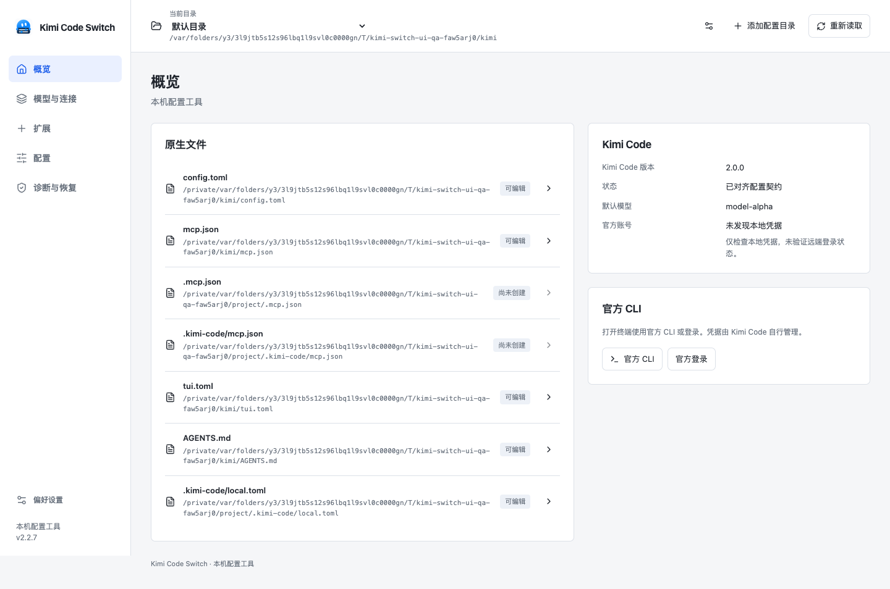

# Kimi Code Switch

轻量的本机 Kimi Code 配置工具。浏览器是唯一界面，本地服务直接读取和修改 Kimi Code 原生文件，帮助你检查变更、处理冲突、备份和恢复配置。

本项目由 `kimi-code-switch-gui` 演进而来，由 **fx1226** 独立维护，保留原项目的 MIT 许可、Git 历史和来源说明。**Web 版本尚未正式发布**，本 README 描述待发行的 Web 实现；旧仓库中的桌面 Release 不提供这里所述的 Web 程序。



截图来自隔离的本机测试环境，使用示例模型与目录。

## 功能入口

| 入口 | 内容 |
| --- | --- |
| 概览 | 当前 Kimi 数据目录、项目工作目录、CLI 版本、默认模型与兼容状态 |
| 模型与连接 | Provider、模型、配置预设，以及启动官方 CLI 和官方登录的入口 |
| 扩展 | MCP 配置；Skills、Plugins 的来源、覆盖关系与诊断清单 |
| 配置 | Kimi 原生设置、CLI 终端设置、用户 AGENTS、项目本地配置 |
| 诊断与恢复 | 文件检查、配置历史、本地备份、恢复计划与未完成操作处理 |

本工具的语言和浅色／深色／跟随系统外观位于独立的偏好设置。保留简体中文、繁体中文、英文、日文、德文和西班牙文。

原生配置保留在各自的编辑草稿中，检查变更后显式应用。应用某个资源时不会顺带提交其他资源的草稿。只有本工具的偏好自动保存。配置预设属于本工具，应用预设时会列出实际要修改的原生字段。

Skills 与 Plugins 首版以发现、来源和诊断展示为主；Plugins 不提供未经验证的私有安装或启停协议。用量洞察、WebDAV、订阅桥接和复制凭据实现的账号轮换不在此版范围。官方账号凭据由 Kimi Code 自行维护。

## 本地运行

首个 Web 发行目标是 **macOS Apple Silicon**。自包含压缩包内的 `kimi-code-switch` 包含 Node 运行时与 Web 静态资源，用户无需安装 Node。其他平台尚未作发行验收。

以下命令适用于从源码构建得到的候选包，以及未来正式发布的 Web 压缩包。在解压后的目录运行：

```bash
./kimi-code-switch
./kimi-code-switch open
./kimi-code-switch status
./kimi-code-switch stop
```

默认命令启动服务并打开默认浏览器；`open` 打开已有服务，没有服务时会启动。重复启动复用同一私有数据目录下的已有实例。首次启动在当前终端运行，关闭网页不会停止服务；使用 `stop` 或终端的 `Ctrl+C` 退出。程序默认不注册开机启动。

```bash
./kimi-code-switch --no-open --port 8417
./kimi-code-switch --data-dir /absolute/path/to/private-data
./kimi-code-switch status --data-dir /absolute/path/to/private-data
./kimi-code-switch stop --data-dir /absolute/path/to/private-data
```

服务只监听 `127.0.0.1`，默认端口 `8417`，占用时向后查找可用端口。API 使用本机 Bearer token、Host 与 Origin 校验。首次打开的地址会携带连接凭证，浏览器接收后将其从地址栏移除；连接失效时运行 `open` 重新进入。

Homebrew **formula 生成脚本已提供**，会使用压缩包的实际 SHA-256 生成公式；Web 版本尚未发布公式或新的 tap 安装入口。这里暂不提供尚不可验证的 `brew install` 命令。

## 原生文件与工具数据

默认 Kimi 数据目录仍为 `~/.kimi-code`，也可选择已有目录或使用 `KIMI_CODE_HOME`。项目改名不会移动官方目录。

| 路径 | 用途 |
| --- | --- |
| `$KIMI_CODE_HOME/config.toml` | Provider、模型和原生配置 |
| `$KIMI_CODE_HOME/mcp.json` | 用户级 MCP 声明 |
| `$KIMI_CODE_HOME/tui.toml` | **CLI 终端界面**设置 |
| `$KIMI_CODE_HOME/AGENTS.md` | 用户级指令 |
| `$KIMI_CODE_HOME/skills/`、`plugins/` | 官方扩展目录 |
| `<项目根>/.kimi-code/local.toml` | 项目本地配置；未识别 Git 根时使用工作目录 |
| `<项目根>/.mcp.json` | 项目级 MCP；同名项覆盖用户级声明 |
| `<工作目录>/.kimi-code/mcp.json` | 当前工作目录 MCP；同名项覆盖前两层声明 |
| `~/.kimi-code-switch/` | 本工具的偏好、预设、目录引用、历史、备份和恢复记录 |

SQLite 不维护第二套活动 Provider、模型或 MCP 配置。切换目录只改变本工具的管理目标，以及由本工具启动的 CLI 参数；它不会切换已经运行的官方桌面客户端。

项目 MCP 与 Skills 的来源按官方规则分别展示。用户、Git 根和工作目录中的配置不能合并后整体写回用户文件。`--data-dir` 统一改变本工具的数据库、服务锁、历史、备份与恢复数据位置，不改变 `KIMI_CODE_HOME`。原生目标的短时写入锁使用系统临时目录中按用户隔离的固定位置，使不同私有目录的本工具实例仍能协调同一个原生文件；这些锁不存储配置正文。

保存流程为：读取原文和版本 → 计算局部变更 → 校验 → 保存恢复点 → 复核版本 → 写入 → 重新读取确认。未修改内容不写入；未知字段、注释和未设置状态尽可能原样保留，不能安全定位的结构会拒绝自动改写。外部编辑产生冲突时需要重新检查，不能绕过版本校验。

多文件操作通过恢复日志处理，不是文件系统级原子事务。恢复状态不明时服务端阻止写入，先在“诊断与恢复”核对文件和记录。备份可能包含原生配置中的 API key，导出文件应按敏感数据保管；备份不复制官方账号凭据、会话或日志。

## 旧版私有数据迁移

检测到 `~/.kimi-code-switch-gui` 后，先展示迁移清单，再由用户执行一次性复制与校验。普通启动不会自动搬迁原生配置。

- 迁移偏好、预设、目录引用和历史；延期功能的数据保留在归档中。
- 保留旧目录及旧版托管的 `.env/<id>` 原生目录引用，不因改名删除它们。
- 清单内容变化时重新检查；旧版仍运行时阻止同时写入。
- 中断后保留迁移记录，按记录恢复；不会用新数据覆盖已有不同内容。

## 兼容依据

当前可编辑基线固定为 **Kimi Code CLI 2.0.0**，官方提交为 `1b89e4b039f052d10f258464413b2047acca12ba`。未检测到 CLI 或版本未经验证时，原生配置以只读方式打开，不通过“高于最低版本”推断兼容。

`kimi doctor` 只参与 `config.toml` 和 `tui.toml` 的候选文件验证；MCP、Skills 和 Plugins 使用各自的解析与发现验证。文件写入成功、配置校验通过、客户端实际读取是不同结果。桌面版共享配置的静态核查不能替代桌面运行验证，桌面专属设置不在管理范围。来源、样本和已执行验证见 [2.0 原生文件契约](docs/kimi-code-2.0-contract.md)。

## 从源码开发

需要支持 `node:sqlite` 的 Node.js **22.13.0 或更新版本**、npm，以及 macOS Apple Silicon 发行构建环境。

```bash
npm ci
npm run dev
```

`dev` 同时启动 Node 服务与 Vite，在浏览器打开开发入口。它默认使用临时的**工具私有目录**，原生 Kimi 目录仍按 `KIMI_CODE_HOME` 解析。开发和测试应显式将 `HOME`、`KIMI_CODE_HOME` 与工具私有目录指向临时样本，避免操作个人配置。

```bash
npm run typecheck
npm test
npm run build:web
npm run build:server
npm run build
npm run check:package
npm run check:performance -- --kimi /absolute/path/to/kimi
```

`build` 生成 macOS arm64 自包含程序、压缩包及 SHA-256 文件，输出到 `dist-release/`。`check:package` 把程序复制到隔离目录，用不含 Node 的 `PATH` 检查内嵌页面、鉴权、启动和退出。候选产物是否达到发行与性能标准，以 [重构验收记录](docs/refactor-execution.md) 的实际证据为准。

`check:performance` 使用隔离样本和真实官方 CLI，测量 5 次服务启动、空闲 CPU/RSS，以及各 100 次 AGENTS 和配置保存；报告保留全部样本，保存门槛采用 P95。通过 `--output /path/to/new-report.json` 指定报告路径，脚本拒绝覆盖已有报告。运行前停止本次其他构建或浏览器验收，以减少测量争用。

| 目录 | 职责 |
| --- | --- |
| `src/renderer/src/web/` | React 页面、独立草稿和显式保存交互 |
| `src/renderer/src/http/` | 类型明确的浏览器 HTTP / SSE 客户端 |
| `src/server/` | 本机服务生命周期、业务 API、迁移和原生能力 |
| `src/server/configuration/` | 配置变更、冲突检查、恢复点和恢复总闸 |
| `src/shared/` | 纯配置规则、协议类型、校验和脱敏 |
| `tests/fixtures/kimi-code/` | 固定官方版本的样本与来源清单 |

贡献规则见 [CONTRIBUTING.md](CONTRIBUTING.md)。官方基线升级见 [兼容性升级流程](docs/kimi-code-upgrade-sop.md)，浏览器验收见 [UI 验证指南](docs/ui-visual-regression.md)。

## 来源与许可

本项目起源于 [sunhao-java/kimi-code-switch-gui](https://github.com/sunhao-java/kimi-code-switch-gui)，保留原 Git 历史、版权声明和 [MIT License](LICENSE)。项目名称为 `kimi-code-switch`，显示名称为 `Kimi Code Switch`，后续开发使用独立仓库 [fx1226/kimi-code-switch](https://github.com/fx1226/kimi-code-switch)。

源码已迁入本独立仓库并通过 CI。[旧仓库 fx1226/kimi-code-switch-gui](https://github.com/fx1226/kimi-code-switch-gui) 已添加迁移说明并归档，保留旧桌面 Release、全部 6 个资产和 28 个历史 tag。旧仓库名称和 fork 关系保留；新的 Web 版本尚未正式发布。验收记录见 [仓库迁移记录](docs/repository-detach-review.md)。

这是独立维护的配置工具，不是 Kimi 官方客户端。旧桌面实现、旧截图和早期调研保留在历史记录中，不代表当前 Web 版本的功能或验证结果。
